<p align="center">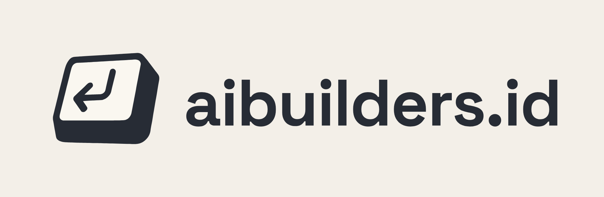</p>

# aibuilders.id — Logo & Brand Guidelines

The official logo kit for **aibuilders.id**. Use the files in this repo as they are. Don't redraw, retype or recolor the logo.

**Contents:** [Logo anatomy](#1-logo-anatomy) · [Variations](#2-logo-variations) · [Color](#3-color) · [Typography](#4-typography) · [Clear space](#5-clear-space) · [Minimum size](#6-minimum-size) · [Backgrounds](#7-choosing-the-right-version-for-the-background) · [Misuse](#8-misuse) · [File guide](#9-file-guide) · [Rebuilding](#10-rebuilding-the-files)

---

## 1. Logo anatomy


The logo has two parts:

| Part | What it is | Meaning |
|---|---|---|
| **Mark** | A tilted, hand-drawn **Enter keycap** | "Press enter": we ship, we build, we make things happen. The hand-drawn edge matches the whiteboard / war-room look of the site |
| **Wordmark** | `aibuilders.id` in Space Grotesk Bold, lowercase | The name and the address are the same thing, so the `.id` is always included |

The mark and the wordmark always keep the same proportions and spacing. Never put them together by hand; use one of the lockup files.

---

## 2. Logo variations

### Primary (default): use this first
For light backgrounds: kraft, cream, white paper, light UI.

| Horizontal lockup | Stacked lockup | Mark only | Wordmark only |
|---|---|---|---|
|  | 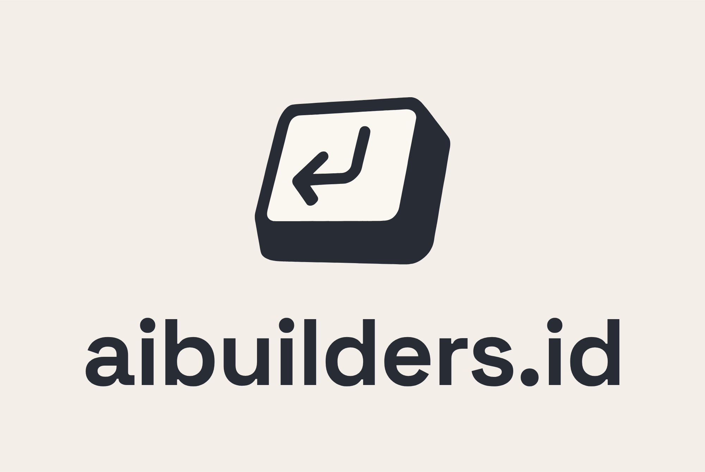 | 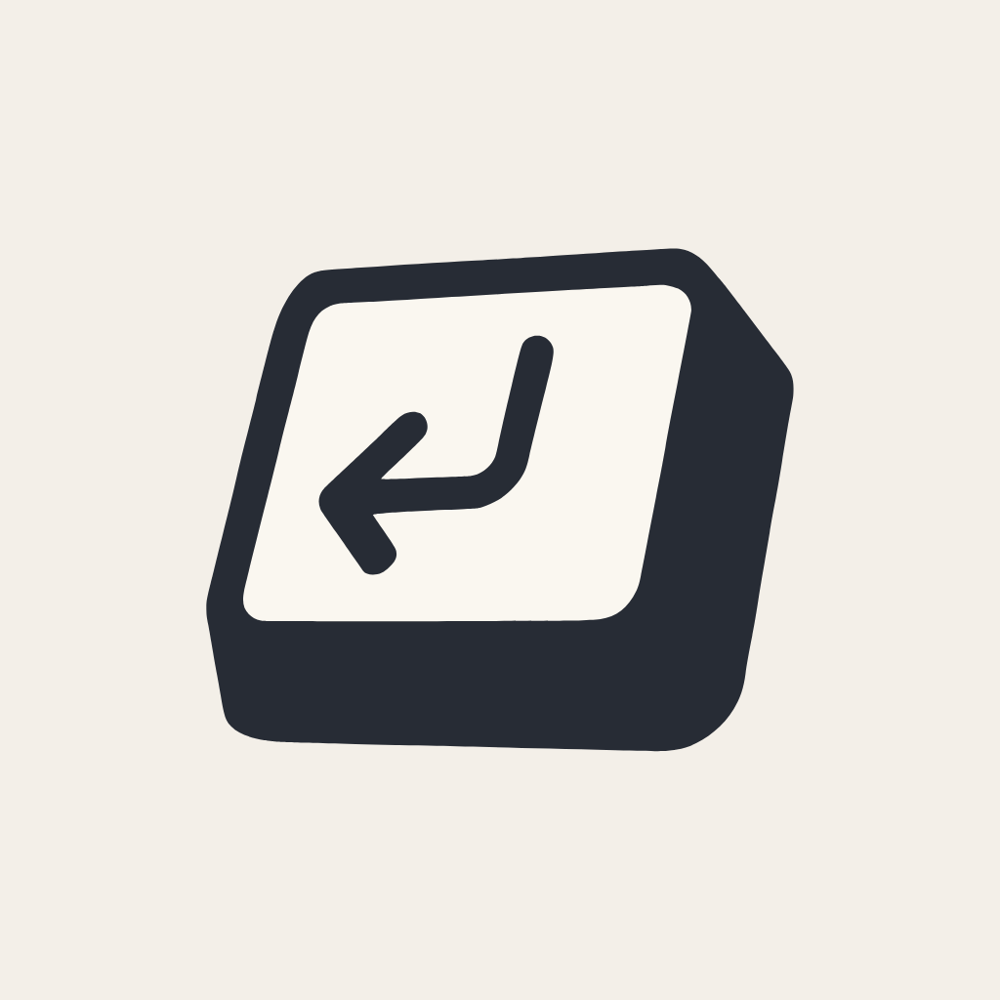 | 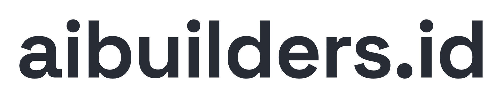 |
| `01-primary/aibuilders-logo-horizontal` | `01-primary/aibuilders-logo-stacked` | `01-primary/aibuilders-mark` | `01-primary/aibuilders-wordmark` |

**Which lockup to use:**
- **Horizontal** is the default: website header, documents, slides, email signatures, invoices.
- **Stacked** is for square or narrow spaces: posters, merch, splash screens, certificates.
- **Mark only** is for small sizes, or when the name is already nearby: favicon, avatar, watermark, app icon.
- **Wordmark only** is for running text, footers, very wide and short spaces, or co-branding rows where every partner is shown as text.

### Reversed: for dark backgrounds and photos
The keycap and text switch to cream, and the key face takes the background color (ink).

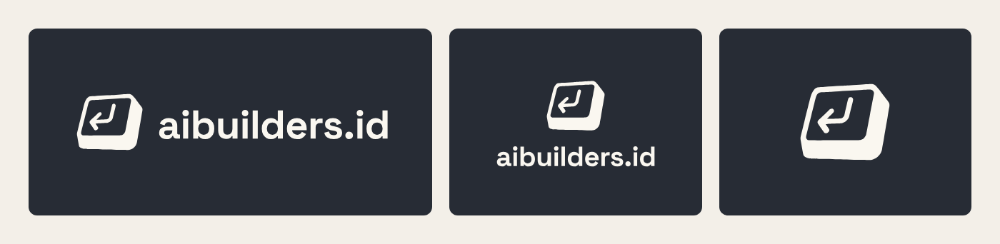

### Mono (one-color): for print and production
For when only one color is possible: screen printing, stamps, embroidery, laser engraving, watermarks, fax/B&W print. The key face is **knocked out** (transparent), so the background shows through.

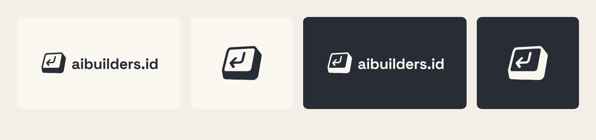

### On brand color
Ready-made lockups on brand backgrounds for banners, social headers and slide covers.

| Ink | Kraft | Red | Blue |
|---|---|---|---|
| 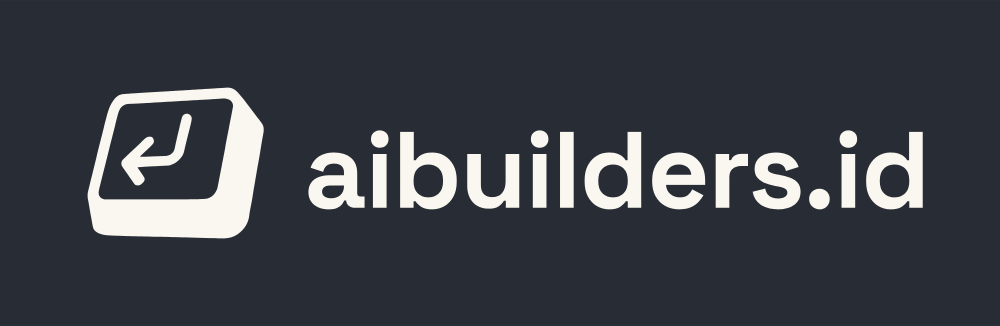 |  | 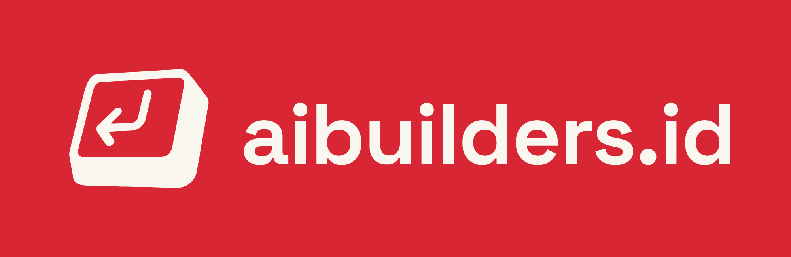 | 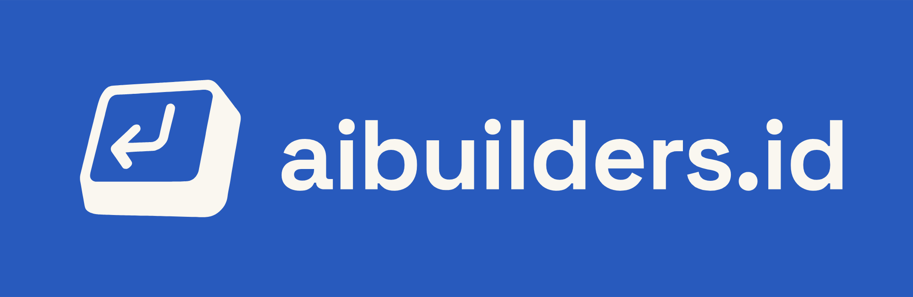 |

### Icon tiles (mark only, square)
For social avatars, app icons, Discord/WhatsApp group pictures, and favicons.

| Ink (default) | Kraft | Red | Blue | Yellow | Favicon |
|---|---|---|---|---|---|
| 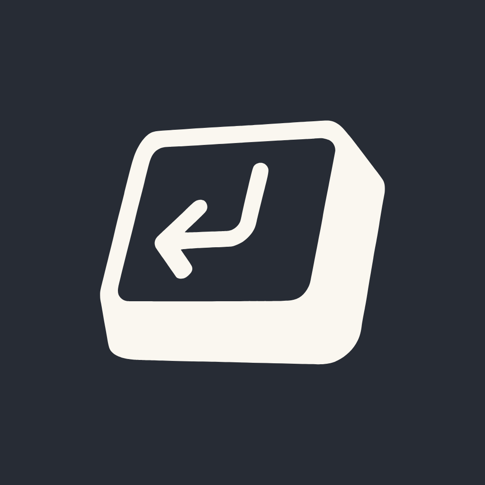 |  | 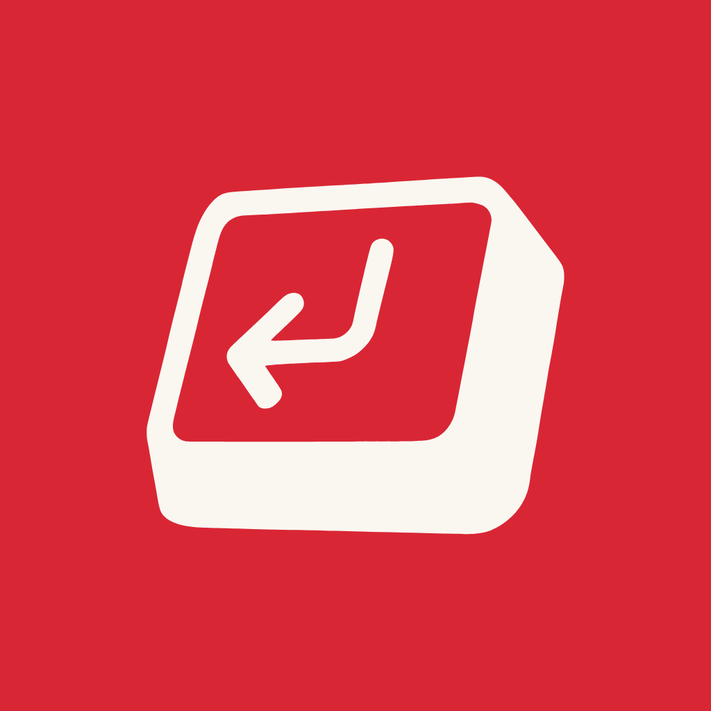 | 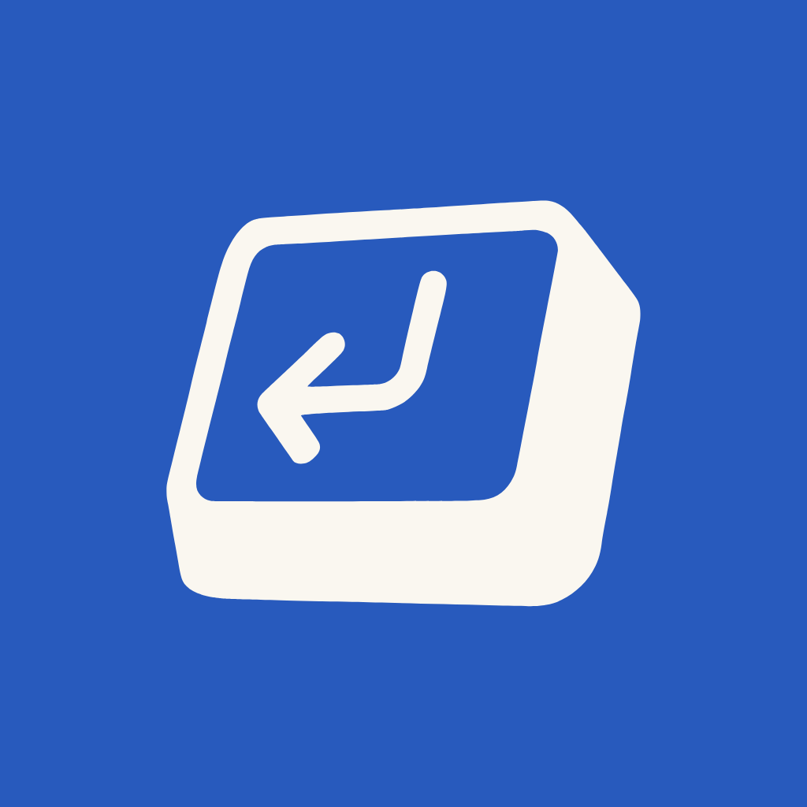 | 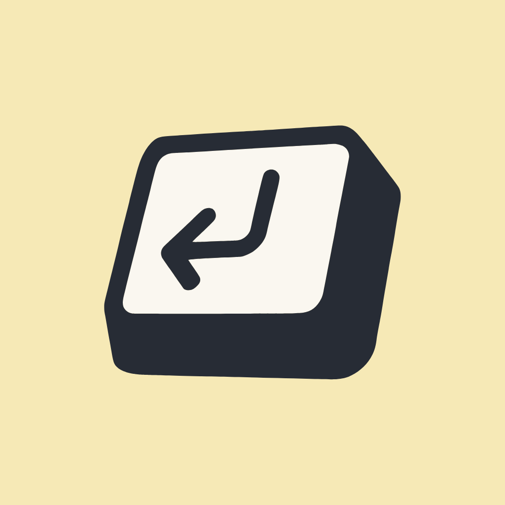 |  |

**Ink is the default avatar.** Use red, blue or yellow only for campaigns or sub-brands, never as a permanent replacement.

---

## 3. Color

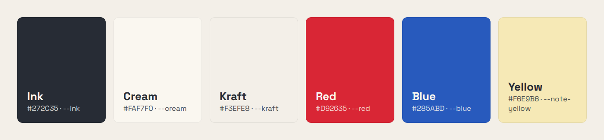

The logo uses the same tokens as the website design system (`ai-builders-prototype/ds.css`). **It never uses pure black `#000` or pure white `#FFF`.** Ink and cream are softer and warmer, and they match the kraft-paper surfaces of the site.

| Name | HEX | RGB | HSL | CSS token | Role in the logo |
|---|---|---|---|---|---|
| **Ink** | `#272C35` | 39 44 53 | 220 15% 18% | `--ink` | Keycap body, wordmark, dark backgrounds |
| **Cream** | `#FAF7F0` | 250 247 240 | 42 50% 96% | `--cream` | Key face, reversed logo |
| **Kraft** | `#F3EFE8` | 243 239 232 | 39 30% 93% | `--kraft` | Default page background |
| **Red** | `#D92635` | 217 38 53 | 355 70% 50% | `--red` | Accent background (cream logo only) |
| **Blue** | `#285ABD` | 40 90 189 | 220 65% 45% | `--blue` | Accent background (cream logo only) |
| **Yellow** | `#F6E9B6` | 246 233 182 | 48 78% 84% | `--note-yellow` | Accent background (primary logo only) |

**The logo itself is only ever ink and/or cream.** Red, blue and yellow are background colors; the logo is never drawn in them, except as the knocked-out key face that shows the background.

---

## 4. Typography

| | |
|---|---|
| **Wordmark** | Space Grotesk **Bold (700)**, all lowercase, tracking −0.015em |
| **Text** | `aibuilders.id`: one word, the `.id` always included, no capitals, no space |
| **Supporting type (site/UI)** | Space Grotesk 400–700 for body, *Permanent Marker* for hand-drawn headings |

The wordmark in these files is **converted to outlines** (vector shapes), so it renders the same everywhere without the font installed. When you write the name in body text, write it as `aibuilders.id` or "AI Builders". Never typeset it yourself to stand in for the logo.

---

## 5. Clear space

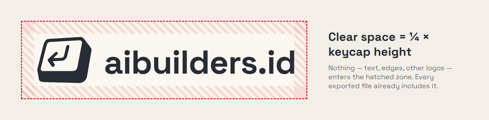

Keep empty space on every side equal to **¼ of the keycap's height**. No text, image edge, other logo or UI element may enter it. **Every exported file already includes this padding**, so place the file as-is and don't crop it.

When the logo sits next to partner logos, use **½ of the keycap's height** between them.

---

## 6. Minimum size

| Version | Digital | Print |
|---|---|---|
| Horizontal lockup | 120 px wide | 30 mm wide |
| Stacked lockup | 80 px wide | 20 mm wide |
| Mark only | 24 px | 8 mm |
| Favicon | use `favicon.svg` / `favicon-32.png` | — |

Below these sizes the arrow inside the keycap closes up. If you need it smaller, switch to the mark only.

---

## 7. Choosing the right version for the background

| Background | Use |
|---|---|
| Kraft, cream, white, light gray | **Primary** (`01-primary`) |
| Ink, black, dark photos, dark mode UI | **Reversed** (`02-reversed`) |
| Red or blue | **Cream** logo: `04-on-color/*-on-red`, `*-on-blue`, or `03-mono/*-cream` |
| Yellow / pastel sticky-note colors | **Primary** |
| Busy photo or pattern | Put a solid ink or kraft panel behind the logo first, then follow the rows above |
| Single-color print job | **Mono** (`03-mono`) in ink or cream |

Rule of thumb: **dark logo on light, light logo on dark.** If you have to think about it, the background is too busy.

---

## 8. Misuse

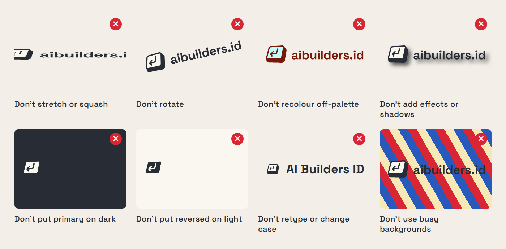

- ✕ Don't stretch, squash or skew the logo. Always scale it proportionally.
- ✕ Don't rotate it. The keycap's tilt is already built in.
- ✕ Don't recolor it outside ink/cream, and don't use gradients.
- ✕ Don't add drop shadows, outlines, glows, bevels or 3D effects.
- ✕ Don't put the primary (dark) logo on dark backgrounds, or the reversed logo on light ones.
- ✕ Don't retype the name, change its case (`AI Builders ID`, `AiBuilders`), or drop the `.id`.
- ✕ Don't place it on busy photos or patterns without a solid panel.
- ✕ Don't rearrange the mark and the wordmark, or change the spacing between them.
- ✕ Don't go back to the old pure black `#000` / pure white `#FFF` logo.

---

## 9. File guide

```
01-primary/     default, for light backgrounds        horizontal · stacked · mark · wordmark
02-reversed/    cream, for dark backgrounds            horizontal · stacked · mark · wordmark
03-mono/        one-color, key face knocked out        ink · cream
04-on-color/    lockups on ink / kraft / red / blue    horizontal · stacked
05-icon/        square mark tiles + favicons           1024 px tiles, favicon 32 / 180 / 512 + favicon.svg
guidelines/     illustrations used in this README
src/            source vectors, font, build scripts
```

**Formats**
- **SVG**: use it wherever you can (web, Figma, Canva, print vendors). It scales to any size.
- **PNG**: 2000 px wide, transparent background (icons are 1024 px). Use it where SVG isn't accepted (Google Slides, WhatsApp, some social tools).

**Web favicon snippet**
```html
<link rel="icon" href="/favicon.svg" type="image/svg+xml">
<link rel="icon" href="/favicon-32.png" sizes="32x32" type="image/png">
<link rel="apple-touch-icon" href="/favicon-180.png">
```

---

## 10. Rebuilding the files

Every SVG and PNG is generated, so don't edit the exports by hand.

```bash
pip install fonttools uharfbuzz playwright && playwright install chromium
python3 src/build.py        # logo variants (SVG + PNG)
python3 src/guidelines.py   # README illustrations
```

- Colors, sizes, padding and the variant list are defined at the top of `src/build.py`.
- `src/black.svg` (keycap body) and `src/white.svg` (key face) are vector traces of the original hand-drawn logo.
- `src/SpaceGrotesk-Variable.ttf` is from Google Fonts (SIL Open Font License).
